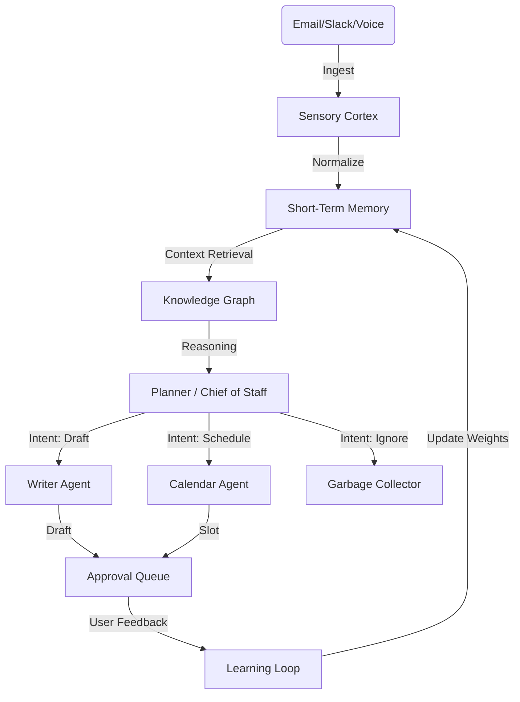

# 🚀 ZROKY: Next-Generation AI Architecture & Innovation Blueprint

**Version:** 2.0 (The "Beyond Operations" Era)
**Architect:** Principal AI Architect (Antigravity)
**Date:** February 2026

---

## 🌌 Executive Vision: From "Chatbot" to "Digital Organism"

Current market solutions (like Marblism) operate on a **"Call & Response"** model: User asks -> Bot acts.
ZROKY's next-generation architecture shifts to a **"Live Organism"** model: The system is **always on**, **perceiving**, **thinking**, and **anticipating**.

We are not just building "better agents"; we are building a **Distributed Cognitive Operating System**.

---

## 🏛️ System Architecture 2.0: The "Neural Enterprise"

We will move beyond the requested 12-Layer Brain into a **Recursive Fractal Architecture** where every agent is a full system, and the "Chief of Staff" is the emergent property of their collaboration.

### 1. The "Hive Memory" (GraphRAG + Temporal)
Standard RAG (Vector DB) is insufficient for complex business logic because it lacks **relationships** and **time**.
*   **Innovation:** **Temporal Knowledge Graph**.
    *   *Concept:* Instead of just storing chunks, we store *events* and *entities* linked by *relations*.
    *   *Implementation:* Neo4j or reduced-complexity NetworkX graph + pgvector.
    *   *Benefit:* ZROKY can answer "Who did I discuss the Q3 budget with last week?" (Vector DBs fail at "last week" + specific entity resolution).

### 2. The "Synapse" Protocol (Inter-Agent Communication)
Agents should not just "pass tasks"; they should "share context".
*   **Innovation:** **Shared Latent Workspaces**.
    *   *Concept:* Aaliyah (EVA) doesn't just tell Stan (Sales) "Call Bob". She shares a "Context Object" containing Bob's psychological profile, past emails, and current mood score.
    *   *Protocol:* `AgentPubSub` over Redis Streams.
    *   *Benefit:* Zero-context loss handoffs.

### 3. Generative UI (The "Liquid Interface")
Static dashboards are dead. The interface should adapt to the **thought**.
*   **Innovation:** **Just-in-Time Component Generation (GenUI)**.
    *   *Concept:* If Aaliyah finds a conflict, she doesn't send text. She *generates* a React component showing a visual timeline comparison of the two conflicting meetings with a generic "Resolve" button.
    *   *Tech:* Vercel AI SDK `useObject` streaming mapped to dynamic React maps.

### 4. The "Sleep Cycle" (Optimization & Dreaming)
Humans consolidate memory during sleep. AI should too.
*   **Innovation:** **Offline Optimization Loops**.
    *   *Action:* At 2 AM, the "Dream Worker" runs. It:
        1.  Compresses daily logs into long-term summary vectors.
        2.  Re-evaluates decisions made today ("Did the user edit my draft? Why?").
        3.  Refines the specialized prompt weights (DPO - Direct Preference Optimization).

---

## 🤖 EVA (Aaliyah) 2.0: The Architected Assistant

Aaliyah is the first implementation of this vision. She is not a script; she is a **state machine wrapping a cognitive engine**.

### 🧠 Aaliyah's Core loop



### ✨ Advanced Capabilities for Aaliyah

1.  **Psychometric Email Mirroring:**
    *   Aaliyah analyzes the *incoming* email's Big 5 Personality traits.
    *   She adjusts her *drafting* style to match (e.g., brief & direct for "High Conscientiousness", warm & detailed for "High Agreeableness").

2.  **The "Gatekeeper" Pattern:**
    *   *Problem:* Calendar spam.
    *   *Solution:* Aaliyah creates dynamic "booking links" that expire or are personalized. She negotiates times via email *for* you, rather than just sending a link.

3.  **Proactive Briefing (The "Morning Download"):**
    *   Instead of a list of meetings, she generates a **Strategic Daily Brief**:
        *   "You have a meeting with Acme Corp. *Context:* They haven't paid the last invoice (Link). I've prepared a gentle reminder email in your drafts."

---

## 🛠️ Implementation Plan: Starting Today

We will build the **Foundation Layer** of Aaliyah, but structrured to support these advanced features.

### Phase 1: The "Sensory Cortex" & Service Structure
We must migrate from the disparate `src/main.py` files to a unified Service Architecture in `apps/api`.

**Directory Structure:**
```text
apps/api/app/
├── services/
│   ├── brain/                # The Shared Cognitive Core
│   │   ├── memory/           # Vector + Graph Hooks
│   │   └── llm/              # OpenRouter/Vertex Handlers
│   ├── aaliyah/              # Aaliyah Specifics
│   │   ├── core.py           # The "Person" Object
│   │   ├── tools/            # Calendar/Email tools
│   │   └── workflows/        # LangGraph definitions
│   └── synapse/              # Event Bus (Redis)
```

### Phase 2: The Action Loop
We will implement the **Inbox Processor** immediately.
1.  **Trigger:** Mock Email Event.
2.  **Think:** Classify & Contextualize.
3.  **Act:** Log decision to DB.

Let's begin by establishing this structure.
